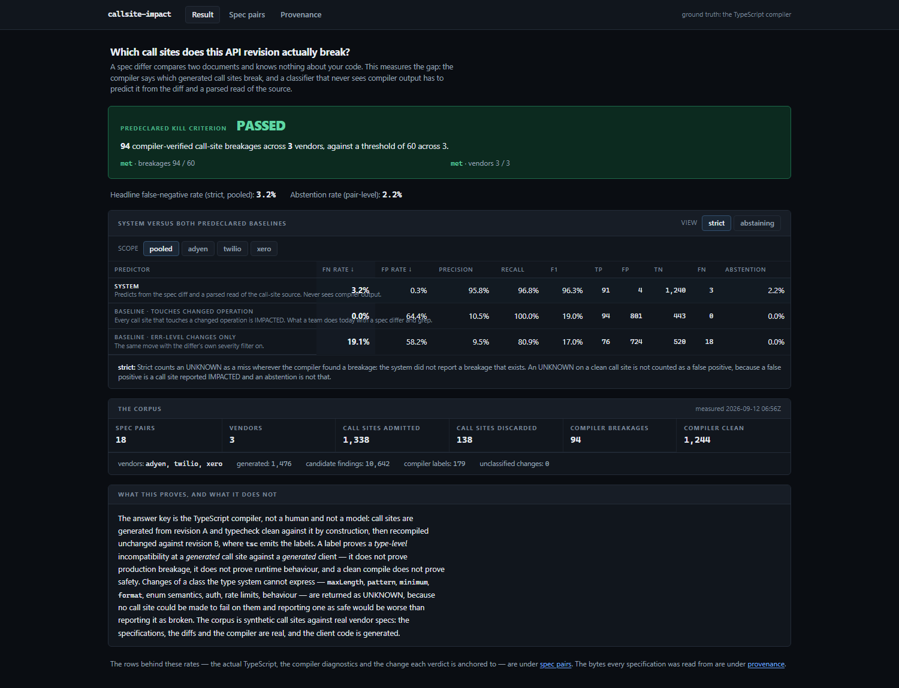
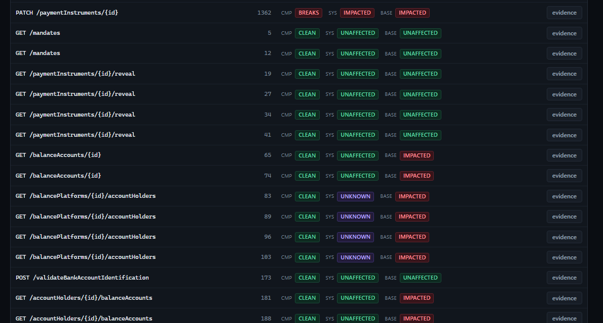
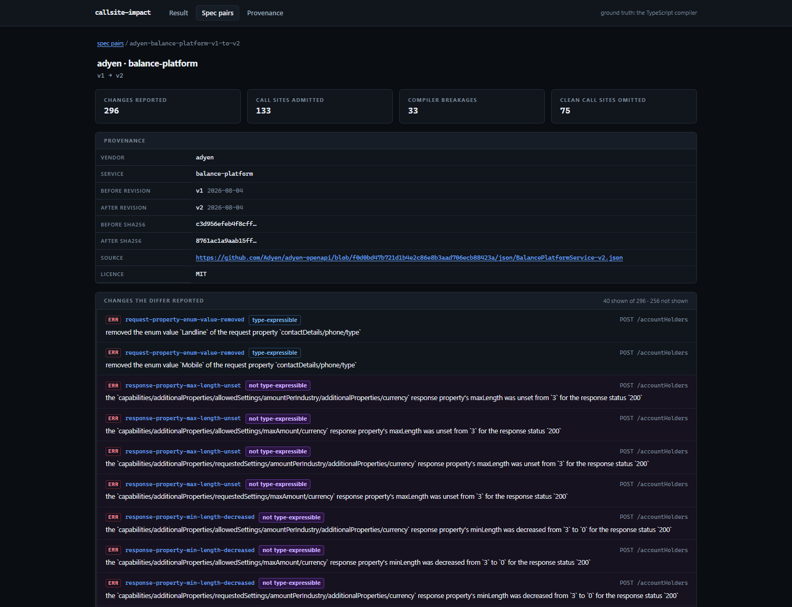
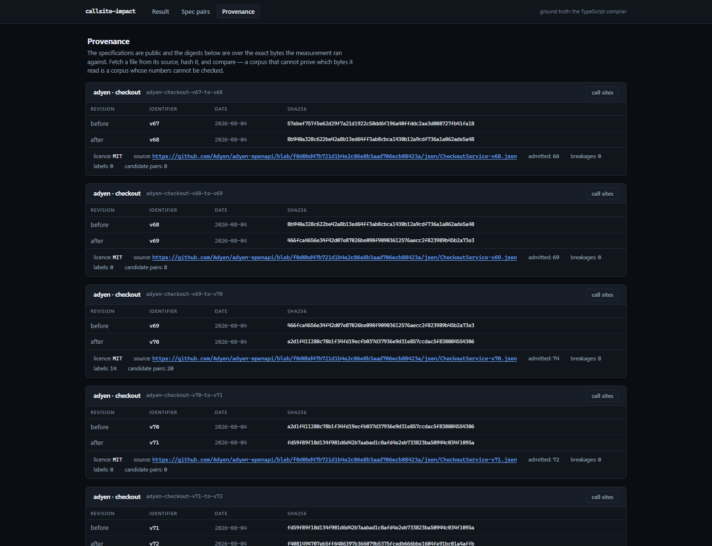

# callsite-impact

**A vendor ships a new API version. Your spec differ says "296 breaking changes". The only question
that matters is: *which of our call sites actually break?* A differ cannot answer it — it compares
two documents and knows nothing about your code.**

296 is a real number from this corpus: Adyen BalancePlatform v1 → v2. The compiler breaks **33** of
the 133 call sites written against it. This repository predicts which 33, and is then graded against
the compiler.

**Live: <https://callsite-impact.vercel.app>** — the result, every spec pair, and the compiler's
verdict beside this tool's on each call site. No sign-in, nothing to run.

---

## Two numbers, and the second one is the honest one

The rule table was fitted to one corpus. Eight of its patterns were written *after* seeing a score on
that corpus. So the repository built a second, disjoint slice — fifteen spec pairs from services the
rules had never seen — **froze it in git before measuring it** ([`9378d58`](DECISIONS.md)), scored it
once, and changed nothing afterwards.

| | Development corpus | **Held-out slice** |
|---|---|---|
| Pairs / vendors | 18 / 3 | 15 / 3 |
| Admitted call sites | 1,338 | 1,342 |
| Compiler-verified breakages | **94** | **265** |
| Precision | 0.958 | **1.000** |
| Recall | 0.968 | **0.196** |
| **F1** | 0.963 | **0.328** |

**Development F1 0.963 is a development number. The unbiased estimate is 0.328.** On unseen services
the system misses four breakages in five.

It is never *wrong* when it speaks — precision 1.000, **zero** false positives across 1,077 clean
call sites. The failure is entirely silence. And it is not uniform: on Adyen services the rules had
never seen it caught **31 of 31**; on two Xero payroll pairs it caught 4 of 193.

### Why it fails, traced to one character

39% of the misses are on operations the differ reported **no change for at all**:

```
revision A   /Employees/{EmployeeId}/LeaveBalances
revision B   /Employees/{EmployeeID}/LeaveBalances
```

`oasdiff` normalises path-parameter names and reports nothing — correctly, by its own semantics: it
is the same endpoint. `openapi-typescript` keys `paths` on the literal string, so every call site on
it is `TS2339`. **30 of the 44 path keys that vanish across the slice are renames like this one.**

**The tool's recall is capped by the differ's recall**, and worse, the gap is silent: no reported
change means no candidate pair, so the call site comes out **UNAFFECTED** rather than UNKNOWN.
[ADR-005](DECISIONS.md) has the full diagnosis. It is **not fixed** — fixing it against the slice
that revealed it would turn the only unbiased number here into a second development number.

---

## The canonical release corpus

**94 compiler-verified broken call sites across 3 vendors in the canonical release corpus.** 18
revision pairs from Adyen, Twilio and Xero, all MIT-licensed public OpenAPI specifications; 1,338
generated call sites that typecheck clean against revision A.

**The absolute count depends on the fixed generation budget** — it is a count, so it scales with how
much client code the generator writes. The rates do not. Both are measured, not asserted:

| Budget | Admitted call sites | Compiler breakages | Vendors | Kill criterion | Precision | Recall | F1 |
|---|---|---|---|---|---|---|---|
| 40 × 3 — harness default | 854 | 52 | 3 | **FAIL** | 0.962 | 0.962 | 0.962 |
| **120 × 4** — canonical release | 1,338 | **94** | 3 | **PASS** | 0.958 | 0.968 | 0.963 |
| 200 × 6 — larger | 1,931 | 142 | 3 | **PASS** | 0.958 | 0.965 | 0.961 |

**The count scales almost linearly with corpus size; F1 moves by 0.002 across a 2.3× range.**
That is the whole point of running it: the kill criterion is sensitive to the budget and the
predictive metrics are not. Reproduce with `make sweep`;
[`artifacts/budget_sweep.json`](artifacts/budget_sweep.json) is written by the run.

Against the two baselines predeclared in ADR-001, on the development corpus:

| Predictor | **False negatives** | False positives | Precision | Recall | F1 |
|---|---|---|---|---|---|
| **This tool** | **3.2%** | **0.3%** | 0.958 | 0.968 | **0.963** |
| Baseline: *every call site on a changed operation* | 0.0% | 64.4% | 0.105 | 1.000 | 0.190 |
| Baseline: *…restricted to ERR-level changes* | 19.1% | 58.2% | 0.095 | 0.809 | 0.170 |

**Read the naive baseline carefully, because it is not bad at finding breakage — it finds all of
it.** It flags **895** call sites to catch the 94 that break. 801 of those are fine. That is the
number a person works through by hand, and it is why "which operations changed?" is not a useful
answer to "what do I have to fix?"

**Seven of the 18 pairs broke nothing at all**, including one Twilio pair with 188 call sites.

Regenerate with `make install && make corpus && make killtest` — the middle step needs `oasdiff`,
see [Run it](#run-it). Every number is written into
[`artifacts/evaluation.json`](artifacts/evaluation.json) by the run that measured it, and CI
re-measures on every push and fails if the committed artifact no longer matches.

### The kill criterion

[`DECISIONS.md`](DECISIONS.md) ADR-001 was committed **before a line of the pipeline existed** and
fixed the threshold at **≥60 compiler-verified call-site breakages across ≥3 vendors**. It has not
been lowered, rewritten or reinterpreted.

> **Canonical release corpus: 94 breakages across 3 vendors. PASSED.**
>
> At the harness default budget the same corpus yields **52 — which would FAIL.** The threshold is an
> absolute count, so it is corpus-budget dependent. Published side by side rather than picked.

**This is a feasibility result, not a generalisation result.** It says a corpus of compiler-verified
labels can be built at all from public specifications. It says nothing about how well the predictor
generalises — that is the 0.328 above.

---

## Why the compiler, and not us

The failure mode for a project like this is obvious: the author writes the code, writes the answers,
and grades themselves. So neither the answers nor the code are written by a person here.

```
vendor spec A ─┬─ openapi-typescript ─→ types A ──┐
               │                                   ├─→ tsc ─→ ADMIT the call sites that compile clean
               └─ generate call sites (seed) ──────┘         (a failure is discarded, never repaired)
                              │
vendor spec B ─── openapi-typescript ─→ types B ──→ tsc ─→ ★ COMPILER LABELS = ground truth
                              │
                              └─→ parse the call-site source (no type checker) ─┐
                                                                                 ├─→ verdicts
vendor spec A + B ─── oasdiff ─→ typed change set ───────────────────────────────┘
```

1. **Call sites are generated from revision A and a seed.** The generator is never shown revision B
   and never shown the diff, so it cannot choose what breaks.
2. **A call site that does not compile against A is discarded, never repaired.** Repairing it would
   let an author who *can* see the diff decide which call sites survive.
3. **The system under test never sees compiler output.** It reads the spec diff and a *parsed* view
   of the call-site source. A guard test fails the build if the classification package imports the
   oracle, or if the fact extractor reaches for `createProgram` or `getTypeChecker`.

---

## The three verdicts, and why the third one is not a cop-out

| Verdict | Meaning |
|---|---|
| **IMPACTED** | this call site breaks under revision B |
| **UNAFFECTED** | the change reaches this operation but cannot reach this call site's usage |
| **UNKNOWN** | the change is of a class the type system **cannot express** |

`oasdiff` calls a decreased `maxLength` a breaking change, and it is one — but `maxLength` does not
exist in the TypeScript type system. No call site can be made to fail on it, and **a clean compile
there is not evidence of safety**. Reporting it as breakage is a false positive; reporting it as safe
is worse. So it abstains, the abstention is counted, and the rate is published: **2.2% of
(call site × change) pairs**, which is **5.5%** of call sites — 74 of 1,338 — once a call site that
abstains on any change is counted as abstaining.

The scorer reports two views and the README shows both. **Strict** counts UNKNOWN as a miss;
**abstaining** excludes it and reports it separately. On this corpus they are identical to three
decimal places, because almost nothing abstains.

---

## What the numbers do not say

- **The kill criterion is an absolute count, so it scales with the generation budget.**
  `MAX_OPERATIONS` and `CALLSITES_PER_OPERATION` are fixed in `pipeline.py` and have never held any
  other value — but **ADR-001 does not pre-register them, and the word "pre-registered" is not used
  of them anywhere.** `git log` proves the budget never changed *after the first committed score*; it
  cannot prove it was chosen before that score was first *observed*, because both landed in one
  commit. See the sweep above and [ADR-004](DECISIONS.md).
- **Two-thirds of the breakages come from a sixth of the corpus.** 238 call sites that pin a narrow
  type — an annotated `const`, or an exhaustive `switch` — carry 59 of the 94 breakages, at a 24%
  breakage rate against 3.2% for an inferred `const`. Both are patterns real clients write, and the
  binding axis is pre-registered; the *proportion* is not.
- **Every development-corpus figure is post-selection.** Eight rules were written after seeing a
  score on it, so 3.2% / F1 0.963 are development numbers. The held-out slice above is the unbiased
  estimate and it is far worse: **F1 0.328**. Where this README quotes 0.963 it says which corpus.
- **The held-out slice is a *data* hold-out, not a *vendor* hold-out.** Same three vendors, new
  services. It tests whether the rule logic generalises to unseen call sites and changes; it does not
  independently test the expressibility table, which is corpus-shaped — 38 of the slice's changes had
  ids the table has never ruled on, against 0 in the development corpus.


- **Compilation proves a type-level incompatibility. It does not prove production breakage.** A
  `maxLength` that shrank will reject your requests at runtime with a clean build.
- **The call sites are generated, not harvested.** The specs, the diffs, the compiler and the labels
  are real; the client code is synthetic. This is never called a corpus of production code.
- **One language.** TypeScript, because it has a structural type system and a spec-to-types
  generator that is not ours. Python and Go call sites are out of scope.
- **Adyen contributes 46 of the 94 breakages, and one pair contributes 33.** Per-vendor numbers are
  published for exactly this reason. Xero is the weakest: 18 breakages, recall 0.833.
- **138 of 1,476 generated call sites were discarded** for not compiling against revision A. The
  generator does not handle every schema shape; discarding is the designed response, and the count
  is published rather than hidden.

---

## Two findings worth the reading

**A differ's "breaking change" count says almost nothing about your blast radius.** 3,383 changes;
94 broken call sites. The gap is not the differ being wrong — every change is real. It is that
breakage is a property of *your code*, and the differ has never seen it.

**The abstention rate was 75.7% and the reason was a bug, not a truth about the domain.** A review
found that the prose-shape table read 16 of `oasdiff`'s sentence forms while the expressibility
table ruled on 24 change classes. The eight unread ones carried 2,294 of the 3,383 changes — they
were ruled decidable and then abstained anyway, for want of a parsed property path. Writing the eight
missing patterns moved abstention to 2.2% and false negatives from 5.3% to 3.2%. A high abstention
rate is very comfortable to publish as a limitation; it was a missing table.

---

## What you are looking at

**The result** — the kill criterion, the system against both predeclared baselines, and a strict /
abstaining toggle because showing one view alone would be a choice about which number to flatter.



**Three verdicts side by side** — `CMP` is the compiler (ground truth), `SYS` is this tool, `BASE`
is the naive baseline. This is an unfiltered slice of the table; the console has a filter for the
rows where they disagree. Every row here with `CMP CLEAN` beside `BASE IMPACTED` is a call site a
team would have opened, read, and closed again having changed nothing.



**One spec pair** — 296 changes reported, 133 call sites admitted, 33 broken. The
`not type-expressible` chips are on the `maxLength` and `minLength` rows, which is what UNKNOWN
looks like in practice rather than in the abstract.



**Provenance** — every specification with the SHA-256 of the bytes the run actually read, so a
reader can fetch the same file and check.



All four screenshots are taken from the **deployed** site above, not a local run — the same
`artifacts/evaluation.json` and `artifacts/findings.json` that CI re-measures on every push.

---

## Run it

```bash
make install     # uv sync --frozen, then npm ci in harness/
make corpus      # fetch the pinned vendor specs (MIT only)
make killtest    # THE MEASUREMENT: generate, admit, compile, classify, score
```

`make corpus` needs the differ this project consumes rather than reimplements:

```bash
go install github.com/oasdiff/oasdiff@v1.29.1
```

```bash
cd frontend && npm install && npm run dev    # the console on :3000
```

---

## The corpus

| Vendor | Pairs | Services | Licence |
|---|---|---|---|
| Adyen | 9 | checkout, balance-platform, account, bin-lookup | MIT |
| Twilio | 6 | conversations, events, flex, messaging, taskrouter, verify | MIT |
| Xero | 3 | bankfeeds, files, payroll-au | MIT |

The specifications are **not committed** — they are 0.1–1.8 MB each and reproducible from a pin.
[`corpus/manifest.json`](corpus/manifest.json) **is** committed and records, for every revision, the
vendor, the exact commit or version, the source URL, the licence and the **SHA-256 of the bytes used**.
That is what makes a run checkable rather than merely repeatable.

**Stripe was acquired, measured, and removed** — `oasdiff` does not finish on its 8 MB revisions
(still running after 35 CPU-minutes, against seconds for every other pair), so the pair cannot be
re-measured in CI. The reason is recorded in `corpus/acquire.py` rather than quietly deleted.

---

## Where AI is allowed

**Nowhere in the measurement.** No model is called anywhere in this repository. Ground truth is a
file written by `tsc`; verdicts come from a rule table over a parsed syntax tree.

This is structural rather than a policy: the `Finding` type has no free-text field, no confidence
score, and a closed `Literal` set of reasons — **a model cannot express a verdict here because the
type has nowhere to put one.** A guard test walks that schema and fails the build if such a field
appears. A model could reasonably rank or explain findings the compiler already confirmed; that is
not built, and is not claimed.

---

## Documents

| File | Purpose |
|---|---|
| [`DECISIONS.md`](DECISIONS.md) | ADR-001: the claim, the oracle, the kill test and every metric, **declared before implementation** |
| [`CLAUDE.md`](CLAUDE.md) | the operating rules this repository is built under |
| [`docs/deployment.md`](docs/deployment.md) | why the public demo has no backend |
| [`harness/README.md`](harness/README.md) | the compiler harness, and the boundary inside it |
| [`PROJECT_STATUS.md`](PROJECT_STATUS.md) | what exists, what is verified, what is not |
